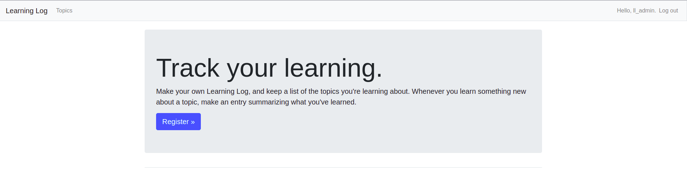
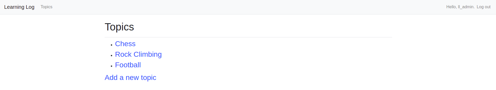
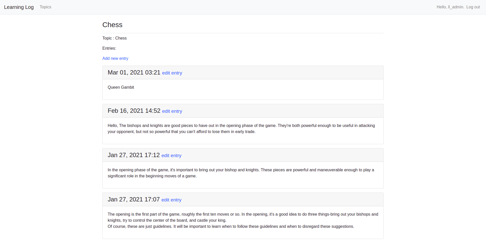

# **This repository based on projects in [Python Crash Course, 2nd Edition, Eric matthes](https://nostarch.com/pythoncrashcourse2e).**

# **Link web:** [Learning Log](http://learning-log-19.herokuapp.com/)

# **Decription:**
This web app called Learning Log that allows user to log the topics they're interested in and to make journal entries as they learn about each topic. The Learning Log home page will describe the site and invite users to either register or log in. Once logged in, a user can create new topics, add new entries, and read and edit existing entries. (*Python Crash Course*)

# Preview
## Home page

## Topics

## Entries
